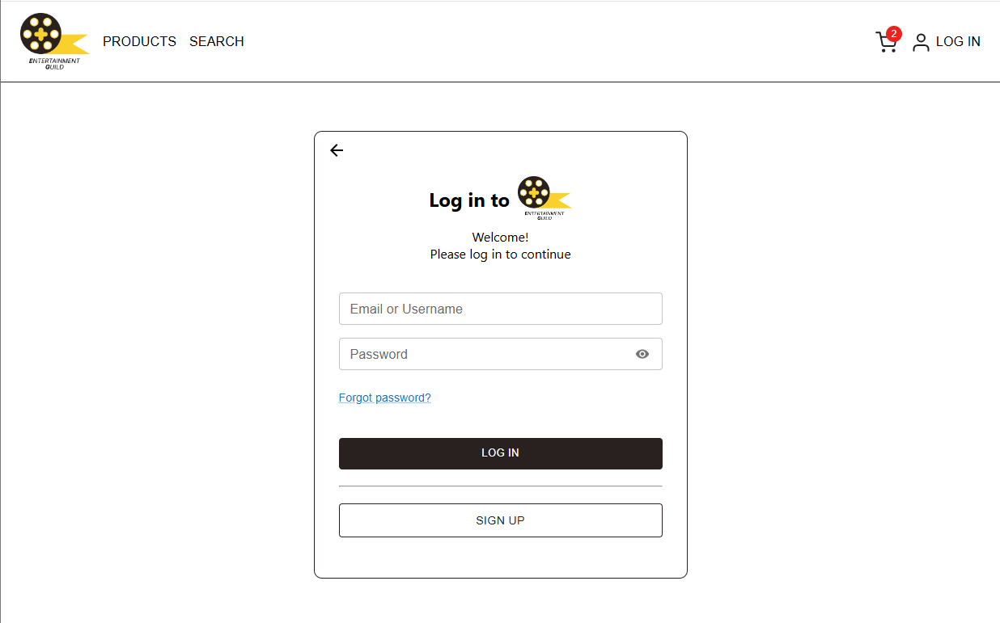
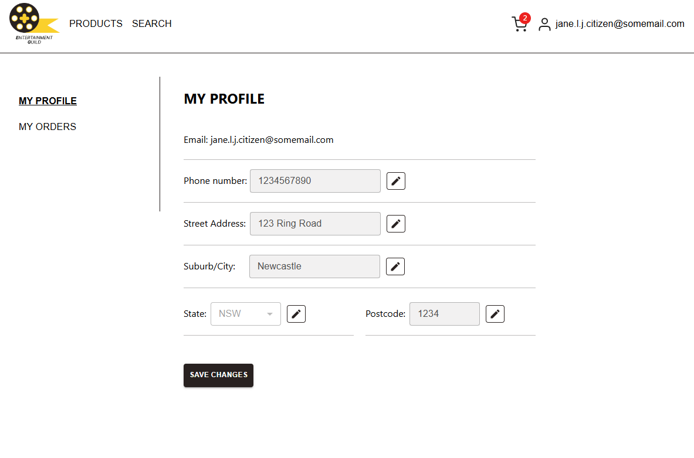
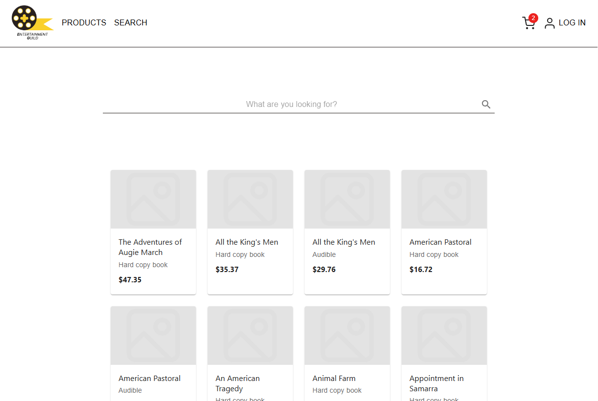
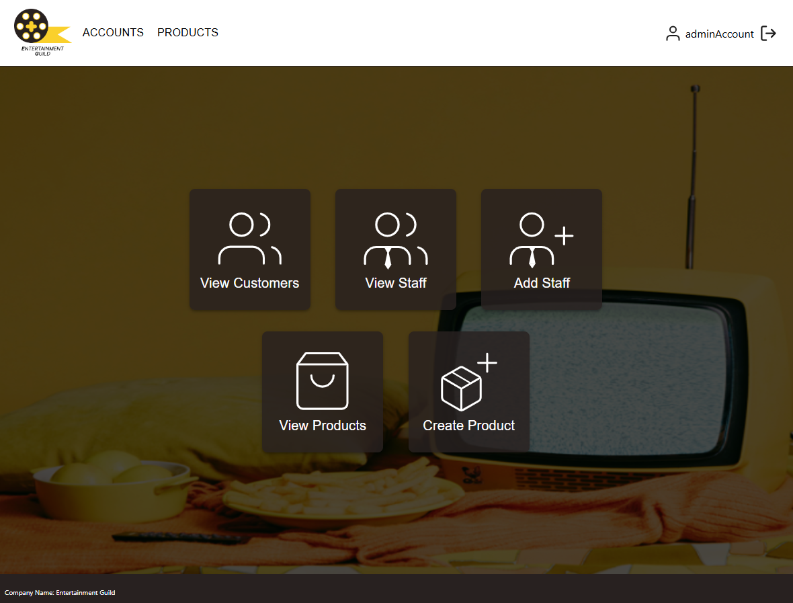
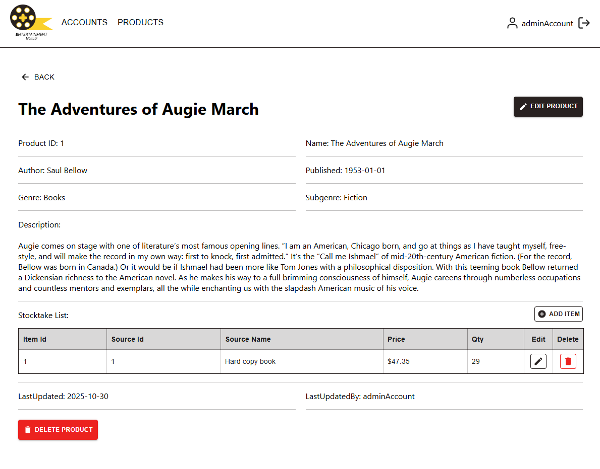

# Entertainment Guild Web Application

## Overview

The **Entertainment Guild Web Application** is a role-based prototype online store management system developed using **ReactJS** and a provided database. The system enables different types of users to interact with the platform through distinct workflows and access control.

Customers can browse and search for items, manage their accounts, and track orders. Employees can view inventory information, while administrators manage products and users through a dedicated interface.

This project demonstrates the implementation of a **role-based web application architecture**, API integration, and user account management in a modern React environment.

---

## User Roles

**Customer:** interact with the store to browse and purchase items. They can create accounts, search for products, track their orders, and update their profile details.

**Employee:** have read-only access to the system and can view inventory items and accounts in the store.

**Administrator:** manage the system. They can add, edit, and delete products, manage user accounts, and maintain the store’s data.

---

## Features

* **Role-based access control** for Customers, Employees, and Administrators
* Customers can:

  * Create accounts and log in
  * Forgot password / Password reset
  * Search items in the store
  * Track order history
  * Update their profile information
* Employees can:

  * View inventory items & accounts
* Administrators can:

  * Add, edit, and delete products
  * Manage user accounts
  * Create other admins
* **Password reset functionality** via EmailJS that sends a link to the password reset page when users request "Forgot Password".
* **Search functionality** for browsing store items
* **RESTful API integration** with the provided database
* **Docker container** used to run the provided database environment

---

## Technologies Used

* **ReactJS**
* **JavaScript**
* **RESTful APIs**
* **Docker** (database container)
* **Postman** (API testing)
* **EmailJS** (password reset email service)
* **Figma** (UI wireframes and design)
* **Visual Studio Code**

---

## System Architecture

The application follows a **client–server architecture**:

* **Frontend:** React-based user interface
* **API Layer:** RESTful endpoints used for data communication
* **Database:** Provided database running inside a Docker container

The frontend communicates with the backend through API requests to retrieve and update store data.

---

### Key Screens

<table>
<tr>
  <td>
     
    
<strong>Login Page</strong> Users log in to access their account or admin panel

  </td>
  <td>
     
    
<strong>Customer Profile</strong> Customers can view and update their personal information

  </td>
</tr>
<tr>
  <td>
     
    
<strong>Item Search</strong> Search and browse items available in the store

  </td>
  <td>
     
    
<strong>Admin Dashboard</strong> Admins manage products, and users (employee & admin)

  </td>
</tr>
<tr>
  <td>
     
    
<strong>Manage Product</strong> Admins can add, edit, and delete products

  </td>
  <td></td>
</tr>
</table>

> Note: This README focuses on **UI Screens and functionality**. The app requires the database to run, so external users cannot interact with a live demo directly.
>

---

## Limitation

* POST request to ProductsInOrders table: When creating an order, the request consistently returned "Cannot read property 'column_name' of undefined", despite verifying field names, data types, and foreign key relationships using Postman and developer tools.

  * This experience highlighted the importance of strict alignment between API requests and database schema when working with backend systems.
* Payment simulation only: The system does not process real payments; all payment handling is simulated to test approved, timed-out, and declined scenarios.
